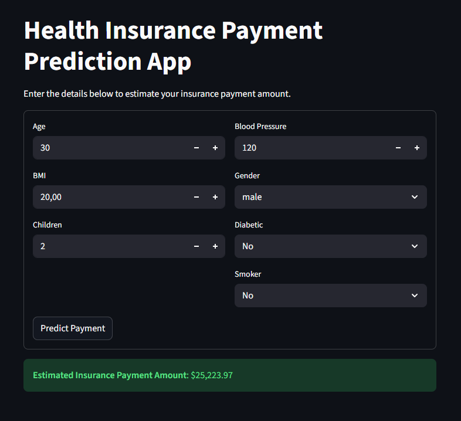

# Health Insurance Cost Prediction

A machine learning project that predicts health insurance costs based on personal health and demographic factors. The project includes comprehensive data analysis, multiple ML model comparisons, and an interactive web application built with Streamlit.

## Project Overview

This project analyzes health insurance data to build predictive models that estimate insurance payment amounts. After comparing multiple algorithms, XGBoost was selected for the final application due to its superior performance (R² score: 0.83).

## Web Application

The Streamlit application provides an intuitive interface for predicting insurance costs based on:
- **Age**
- **BMI** (Body Mass Index)
- **Blood Pressure**
- **Number of Children**
- **Gender**
- **Diabetic Status**
- **Smoking Status**

### Application Interface



## Features

- **Exploratory Data Analysis (EDA)**: Comprehensive data visualization and statistical analysis
- **Multiple ML Models**: Comparison of 5 different algorithms
- **Interactive Web App**: User-friendly interface for real-time predictions
- **Model Persistence**: Saved encoders and scalers for consistent predictions

## Technologies Used

**Libraries:**
- `pandas` - Data manipulation and analysis
- `numpy` - Numerical computations
- `matplotlib` & `seaborn` - Data visualization
- `scikit-learn` - Machine learning algorithms and preprocessing
- `joblib` - Model serialization
- `streamlit` - Web application framework
- `xgboost` - Gradient boosting implementation

**Machine Learning Algorithms Tested:**
1. Linear Regression
2. Polynomial Regression
3. Random Forest
4. Support Vector Regression (SVR)
5. XGBoost (Selected - R² Score: 0.83)

## Model Development Process

### 1. Exploratory Data Analysis
- Visualized distributions and correlations
- Identified patterns in insurance costs
- Handled missing values
- Analyzed feature relationships

### 2. Data Preprocessing
- Applied **LabelEncoder** to categorical columns (Gender, Diabetic, Smoker)
- Saved encoders for consistent transformation in production
- Prepared features for model training

### 3. Machine Learning
- Implemented **StandardScaler** for feature normalization
- Trained and evaluated 5 different algorithms
- Applied **GridSearchCV** for hyperparameter tuning
- Compared model performance using R² score
- Selected **XGBoost** as the best performer

### 4. Model Performance

| Algorithm | R² Score |
|-----------|----------|
| XGBoost | **0.83** |
| Random Forest | 0.82 |
| Polynomial Regression | 0.78 |
| Linear Regression | 0.72 |
| SVR | 0.50 |

### Running the Application
```bash
streamlit run app.py
```

---
